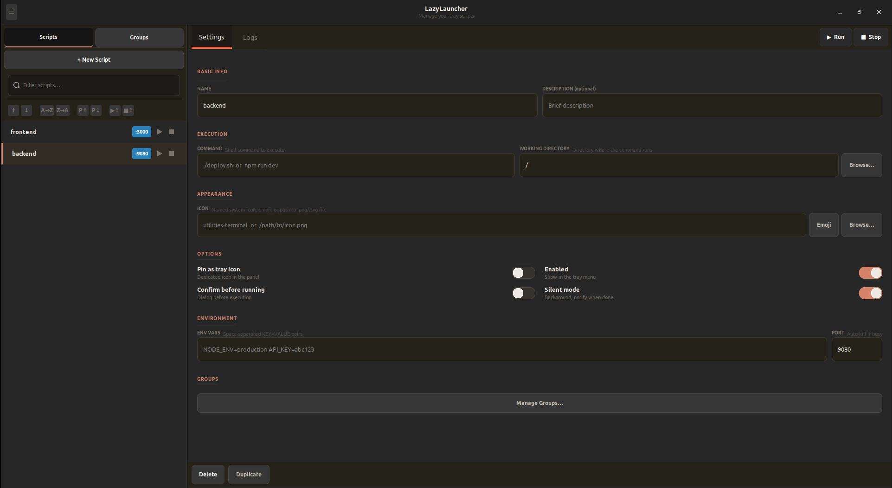

<p align="center">
  
</p>

<h1 align="center">LazyLauncher</h1>

<p align="center">Manage and run shell scripts. Organize with groups, pin favorites, monitor ports, and run silently.</p>

<p align="center">
  
</p>

## Install

```bash
curl -fsSL https://raw.githubusercontent.com/alancoosta/lazylauncher/main/install.sh | bash
```

Autostart is set up automatically — just log out and back in after install.

## Features

### Scripts
- Tray menu with all your scripts — click to run in a terminal
- Manager UI to add, edit, delete, reorder, duplicate scripts
- Pin scripts as dedicated tray icons
- Per-script working directory and environment variables
- Silent mode — run in background, get notified when done
- Confirmation dialogs for dangerous scripts
- Per-script logs with viewer
- Port monitoring — auto-kill busy ports before running

### Groups
- Organize scripts into groups
- Run/Stop all scripts in a group at once
- Duplicate groups with all script associations
- Group settings panel with notebook tabs (same layout as scripts)
- Per-group script list with inline actions (Settings, Logs, Run, Stop)
- Port badges visible on each script inside the group card

### Sorting & Filtering
- Filter scripts and groups by name
- Sort scripts by name (A-Z / Z-A), port (1-100 / 100-1), or status (running/stopped first)
- Sort groups by name, script count, or running status
- Sort scripts within a group card independently
- Manual reorder with up/down buttons

### General
- Import/export config between machines
- Hot-reload — tray updates when you save

## Uninstall

```bash
rm -rf ~/.local/share/lazylauncher
rm ~/.local/bin/lazylauncher
rm ~/.local/share/applications/lazylauncher*.desktop
rm ~/.config/autostart/lazylauncher.desktop
```
